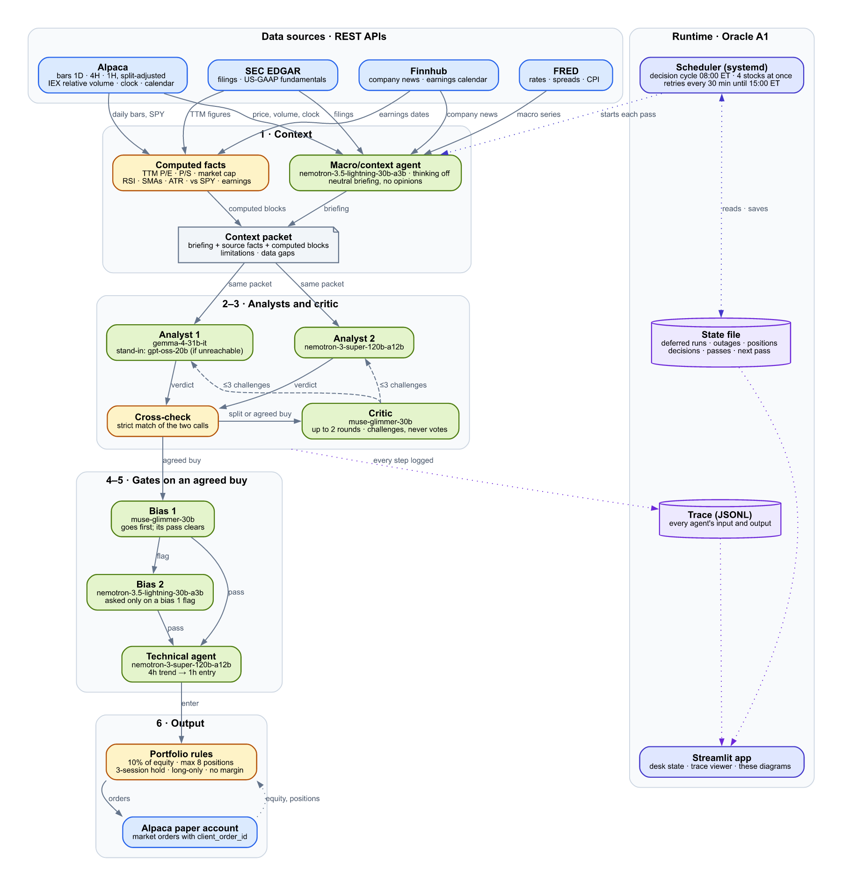
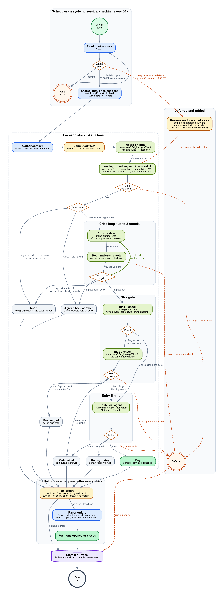

# claw-agent-desk

An "analyst desk" of independent open-weight LLM agents that debates and cross-checks before recommending a US-stock portfolio — built for the NVIDIA Build a Claw Paris challenge.

Rather than asking one model for a stock pick, the desk runs two analysts on different model families, makes them agree before anything is decided, challenges an agreed buy with a critic, checks it for two kinds of bias, and only then times the entry. Every step is logged, so the trace shows the argument, not just the outcome.

## Why

A single LLM asked "should I buy this stock" will answer confidently regardless of whether the evidence supports it. This project tests whether structured disagreement between independently-chosen models — each with its own failure modes — produces steadier, more defensible calls than one model's guess. The desk is long-only, real shares, no leverage, and trades a live paper account so the calls can be checked against what actually happened.

## How it works

**Architecture** — what each agent is, which model runs it, and what passes between them:



**Flow** — every path one stock can take through a pass, from the scheduler's poll to a filled order, including the deferral and critic-loop retries:



Both diagrams are generated from the live code (`ui/diagrams.py`) — every model name and limit shown is read out of the pipeline, not typed by hand, so they're never stale. The running app draws them live in its **Architecture** and **Flow** tabs.

### The pipeline, stage by stage

1. **Context** — Alpaca (daily/4h/1h bars, IEX relative volume), SEC EDGAR (US-GAAP filings), Finnhub (news, earnings calendar) and FRED (macro) are gathered per stock; the desk computes its own valuation (P/E, P/S, market cap from trailing-twelve-month filings), technicals (RSI, moving averages, ATR, 52-week range, vs. SPY) and earnings blocks. A neutral macro briefing (thinking off, no opinions) is layered on top. Every source failure becomes a disclosed data gap instead of a crash.
2. **Two analysts, in parallel** — `analyst_1` (gemma-4-31b-it) and `analyst_2` (nemotron-3-super-120b-a12b), picked to be as independent as Build's available models allow, each read the full context packet and return a `buy`/`hold`/`avoid` verdict with cited evidence, temperature 0.
3. **Cross-check and critic** — the two verdicts must match exactly to proceed. Buy vs. hold goes to a critic (a third model) that challenges both analysts without ever giving its own recommendation; they reconsider and re-vote, up to 2 rounds. Buy vs. avoid aborts immediately — two analysts pointing opposite directions is not a call the desk will act on.
4. **Bias gate** (agreed buys only) — two more models independently check the case for being news-driven, resting on stale news, or chasing a recent move. A veto needs *both* to flag it; a single flag is recorded but doesn't stop the buy.
5. **Technical agent** (surviving buys only) — reads the 4-hour trend and the 1-hour chart to decide whether to enter now or wait for a specific chart-based reason. It can delay a buy; it can never create one.
6. **Portfolio** — an agreed, ungated, timed buy opens a position sized at 10% of account equity (whole shares, max 8 positions, no margin). A position is sold on an agreed avoid or when its 5-session holding period ends (the far end of the analysts' 2–5 day horizon). Orders carry a deterministic `client_order_id`, so a retried submission is recognized rather than duplicated.

### What's deliberately *not* here

No shorting, no derivatives, no leverage, no negotiated deals — long-only real shares. No valuation data from a paid source, no forward guidance, only trailing filings. **Volume is IEX-only** (Alpaca's free feed), never consolidated market volume — the desk compares it against its own rolling baseline rather than trusting an absolute number, and every agent is told this limitation explicitly.

## Running it

```bash
python -m venv .venv
.venv/Scripts/python -m pip install -r requirements.txt   # Windows
# .venv/bin/python -m pip install -r requirements.txt     # Linux (deployment)

.venv/Scripts/python -m pytest                             # full test suite, fully offline

.venv/Scripts/python -m agents AAPL MSFT NVDA               # one live run, no LLM (data only)
.venv/Scripts/python -m agents AAPL --analysts analyst_1 analyst_2   # full desk on one stock

.venv/Scripts/python -m agents.scheduler --once decision    # one unattended decision cycle
.venv/Scripts/streamlit run ui/streamlit_app.py              # the app: run the desk by hand
```

Six credentials are required for a live run (Alpaca, FRED, Finnhub, SEC EDGAR user agent, NVIDIA Build) — see `.env.example`. The test suite needs none of them; every client is exercised against a fake HTTP session.

## Status: live paper trading

The desk has been running unattended on an Oracle Cloud ARM instance since Sept 28, 2026, deciding a 40-stock watchlist (22 until Oct 6) once daily (08:00 ET, before the open) with retries every 30 minutes through the morning, placing real paper orders on Alpaca. As of this writing it holds three open positions from agreed, cross-checked, bias-cleared, technically-timed buys — the rest of the watchlist mostly resolves to hold, with contradictory or unreachable-model cases correctly deferred or aborted rather than guessed at.

Full day-by-day findings, every model swap and why, and the live trading log are in `CLAUDE.md`.

## Repository layout

- `data_layer/` — thin, retry-aware clients for Alpaca, FRED, SEC EDGAR, Finnhub and NVIDIA Build, sharing one HTTP-retry/caching core.
- `agents/` — the pipeline: macro/context, the two analysts, cross-check, critic loop, bias gate, technical agent, portfolio, scheduler, state.
- `ui/` — the Streamlit app: a live run viewer, desk-state and trace viewers, a Positions tab (every trade on its price chart with the decision behind the buy and the sale), and the architecture/flow diagrams above.
- `demo/` — a frozen snapshot of the desk's trades (`python -m ui.snapshot`), so the Positions tab works offline.
- `deploy/` — the Oracle A1 deployment (systemd unit, setup script, README).
- `tests/` — the full offline test suite; every live client is exercised against a fake session.
- `claw_agent_spec.md` — the original working spec (architecture, model table, data sources, build schedule).
